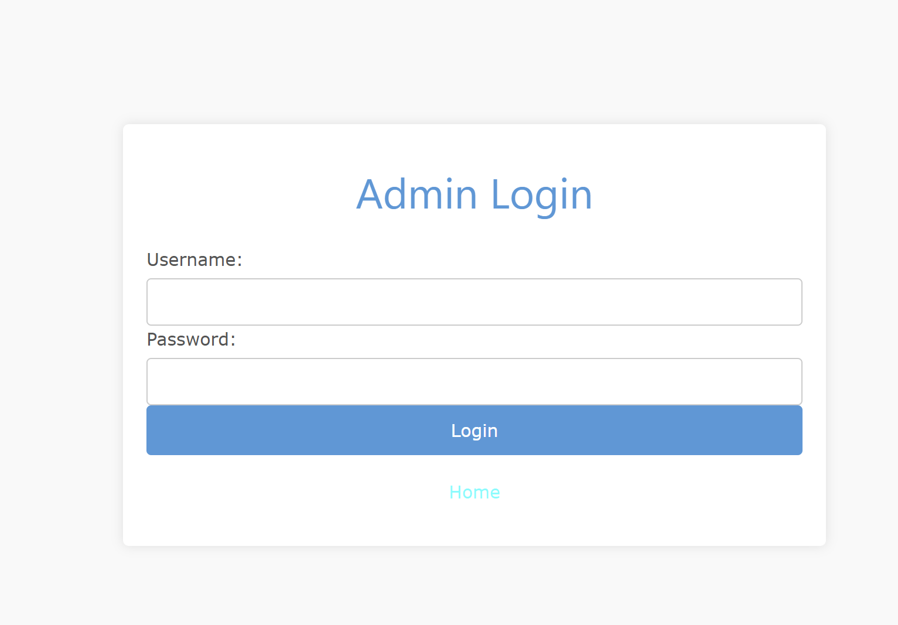

# 🚀 Blog Application with Docker

This is a simple **Blog Application** I built that allows users to register, log in, and manage blog posts. It includes an admin interface to manage users and posts. The app is built using **Node.js**, **Express**, **MySQL**, and **Docker** for easy containerization.
# ❗(Dip Note! - Ansible's documentation is in /ansible folder)
## 🌍 Project Structure


## 🛠️ Setup Instructions

Here’s how I set everything up and ran the application using Docker:

### 1. 🔑 Configure the `.env` File

I created a `.env` file to store all the necessary credentials for my app. Here's the format I used for my `.env`:

```env
DB_HOST=<snipped>
DB_USER=<snipped>
DB_PASSWORD=<snipped>
DB_NAME=project
```
### 2.🌐 Set Up the Database

I included a `db.sql` file that gets automatically executed when the database container starts. This file creates the necessary tables and inserts default data. 

Admin credentials are inserted by default in this SQL file.

The database will be automatically created when the `db` container starts, and the tables will be set up according to this SQL file.

### 3. 🌐 Docker Configuration

I used **Docker Compose** to manage the app and database containers. This is what my `docker-compose.yml` looks like:

```yaml
version: '3.3'

networks:
  app-network:
    driver: bridge

services:
  db:
    image: mysql:8
    environment:
      MYSQL_ROOT_PASSWORD: ${DB_PASSWORD}
      MYSQL_DATABASE: ${DB_NAME}
    volumes:
      - ./db.sql:/docker-entrypoint-initdb.d/db.sql
    ports:
      - "3306:3306"
    networks:
      - app-network
  app:
    build:
      context: .
      dockerfile: DockerFile
    ports:
      - "5000:5000"
    environment:
      DB_HOST: db
      DB_USER: ${DB_USER}
      DB_PASSWORD: ${DB_PASSWORD}
      DB_NAME: ${DB_NAME}
    networks:
      - app-network
    depends_on:
      - db
```

This sets up two services:

- **db**: The MySQL database container
- **app**: The Node.js application container


### 4. ⚙️ Build and Run the Application with Docker Compose

Once I have everything configured, I run the following commands to build and start the containers:

#### Step 1: Build and Start the Containers

```bash
docker-compose up --build -d
```

This command will:

- Build the Docker images for the app and database using the `DockerFile` and the `docker-compose.yml` configuration.
- Start the containers in detached mode, so they run in the background.


### 5. 🚀 Start the Application

After running the containers, I can access the app at **http://localhost:5000**.

### 6. 📝 Routes

Here’s a list of the routes available in the app:

- **`/`**: Home page

- **`/login`**: User login page

- **`/register`**: User registration page

- **`/dashboard`**: User dashboard with blog posts
- **`/admin-login`**: Admin login page


- **`/admin-dashboard`**: Admin dashboard
- **`/admin/edit-users`**: Admin page to edit user accounts
- **`/admin/delete-users`**: Admin page to delete user accounts
- **`/admin/edit-posts`**: Admin page to edit blog posts
- **`/admin/delete-posts`**: Admin page to delete blog posts
- **`/create`**: Page to create a new blog post
- **`/my-feed`**: Page to view user-specific blog posts
- **`/blog/:postId`**: Page to view details of a specific blog post
- **`/edit/:postId`**: Page to edit a specific blog post
- **`/delete/:postId`**: Page to delete a specific blog post
- **`/logout`**: Log out and end the session

### 7. 📝 Admin Credentials

If I need to log in as an admin in /admin-login page, I use the these credentials:
As I said they are inserted in `db.sql` file
- **Username**: `admin`
- **Password**: `96S10a11`

