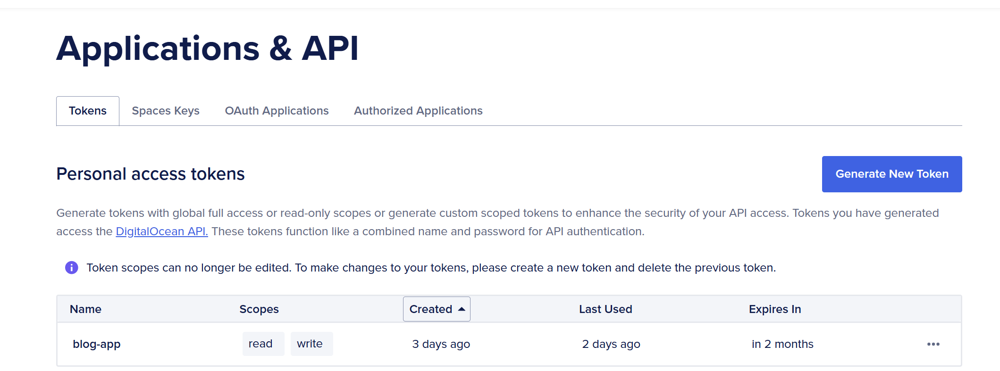
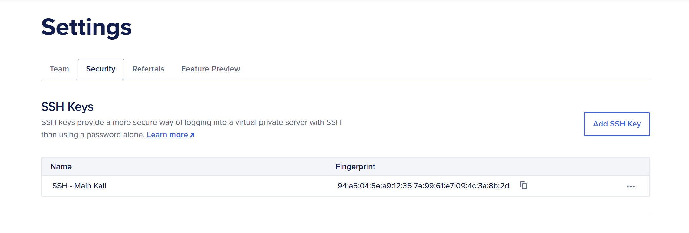

# 🛠️ Ansible Setup for Blog Application

This repository contains all the Ansible playbooks I used to automate the setup and configuration of the infrastructure for the **Blog Application**. With these playbooks, I  provision and configure the necessary resources, like **MySQL**, **Node.js**, and **Nginx**, on DigitalOcean droplets.


## 🌍 Project Structure

Here’s what the folder structure looks like:


- **roles/**: Contains different roles for provisioning and setup droplet, app setup, database setup, and testing.
- **vault.yml**: This is where I store sensitive data, such as API tokens and database credentials, securely encrypted with Ansible Vault.

## 🔑 Vault Configuration

Here’s what the `vault.yml` file looks like:

For `vault_do_token` I generated API token in my digital ocean account


In order to get `vault_ssh_key_fingerprint` I inserted my public key to the digital ocean account.


```yaml
vault_do_token: "<snipped>"
vault_ssh_key_fingerprint: "<snipped>"
vault_db_user: "<snipped>"
vault_db_password: "<snipped>"
vault_db_name: "project"
db_host: "<snipped>"
db_user: "<snipped>"
db_password: "<snipped>"
db_name: "project"
```

Note: The **Ansible Vault password** is my name. I’ll need to enter this password when running the playbooks to decrypt the file and access the sensitive data.

## 🛠️ Roles Overview

### 🧑‍💻 **Provision Role**

The `provision` role is responsible for creating the DigitalOcean droplets where the app will live. It’s essentially setting up the environment from scratch.

### 🔧 **Setup Role**

The `setup` role is where I define the basic setup tasks.  It installs everything I need, like Docker, Docker Compose. It makes sure everything is ready for the app to run.

### 💻 **App Role**

The `app` role takes care of deploying the **Node.js** application on the server. It builds the Docker image for the app, runs it in a container

### 🗄️ **Database Role**

This role is all about setting up **MySQL**. It creates the database and the necessary tables (like `users`,`admin` and `posts`) and loads the schema. The database credentials come from the `vault.yml` file

### 🌐 **Nginx Role**

Here, I configure **Nginx** to act as a reverse proxy and load balancer for the web application.

### 🧪 Testing Role
The testing role is responsible for verifying that the web application is functioning correctly. 


## 🚀 Running the Playbooks

To run the playbooks and provision the infrastructure, I usefd this command:

```bash
ansible-playbook -i inventory.ini playbook.yml --ask-vault-pass
```
